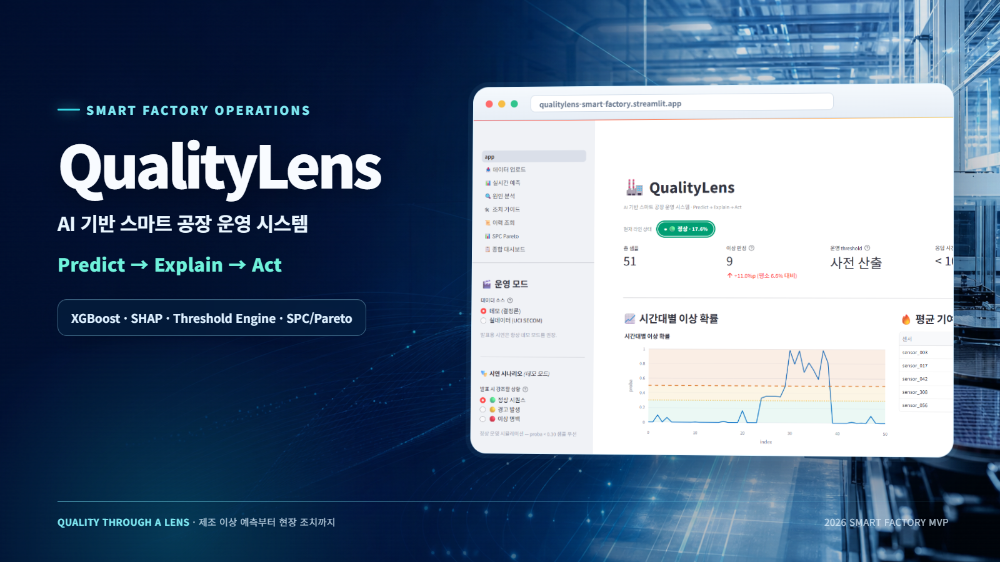
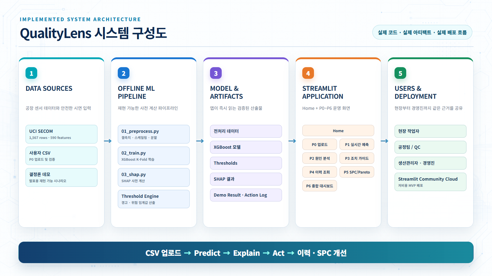
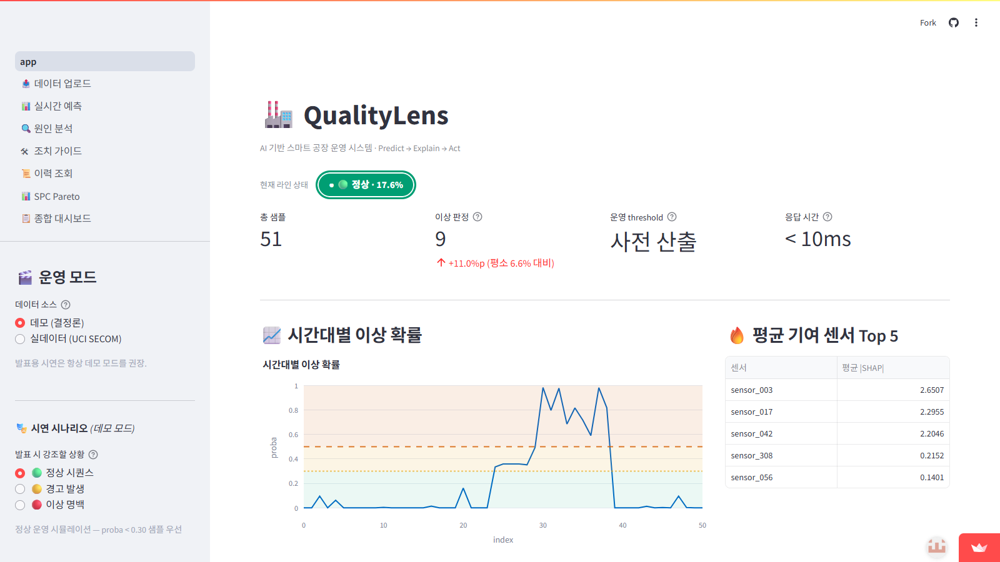
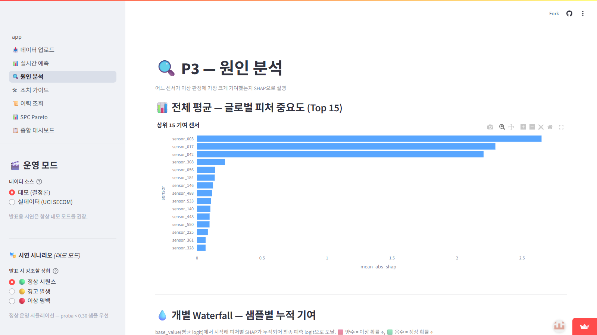
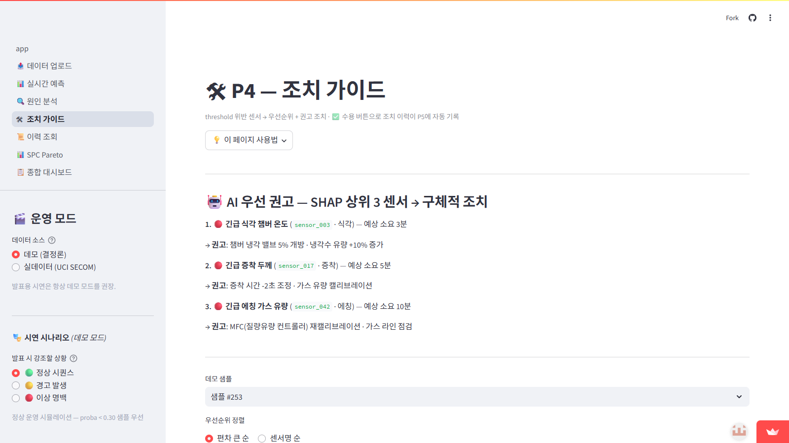
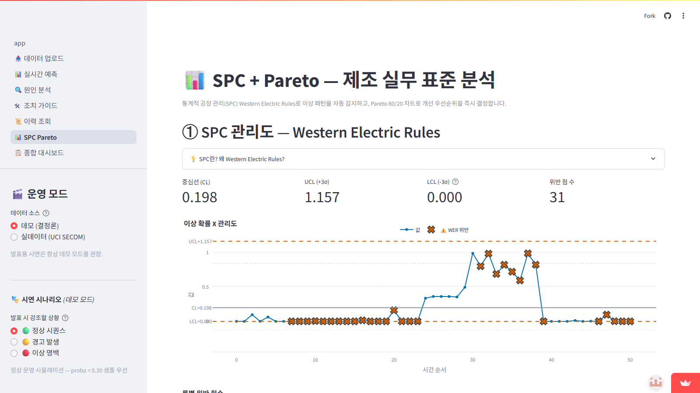

# 2026 스마트 공장 운영 시스템 MVP 개발 해커톤



<p align="center">
  <a href="https://qualitylens-smart-factory.streamlit.app/"><strong>라이브 앱</strong></a>
  ·
  <a href="docs/presentation/final/qualitylens-finals-presentation.pdf"><strong>본선 최종 발표 자료</strong></a>
  ·
  <a href="docs/presentation/slides.html"><strong>발표 자료 HTML</strong></a>
</p>

> **대회 결과:** 예선을 통과해 2026년 5월 22일 본선에 참가했으며, 최종 수상에는 이르지 못했습니다.

`XGBoost` · `SHAP` · `Threshold Engine` · `SPC/Pareto` · `Streamlit`

## 프로젝트 개요

| 항목 | 내용 |
|------|------|
| 주제 | AI 기반 스마트 공장 운영 시스템 MVP 개발 |
| 프로젝트명 | QualityLens |
| 핵심 방향 | 공정 이상 예측, 원인 분석, 조치 가이드를 하나의 플랫폼으로 연결 |
| 제출 기한 | 예선 ~ 2026.05.13(수) 10:00 |
| 본선 | 2026.05.22(금) 오프라인 구현 및 발표 |
| 결과 | 예선 통과 · 본선 참가 · 미수상 |
| 배포 | [QualityLens Streamlit 앱](https://qualitylens-smart-factory.streamlit.app/) |

## 한 줄 소개

**QualityLens는 공정 센서 데이터를 기반으로 이상 징후를 미리 예측하고, 원인을 설명하고, 바로 실행할 조치까지 제안하는 AI 스마트 공장 운영 플랫폼입니다.**

## 핵심 문제 정의

- 제조 현장에서는 이상 징후를 늦게 발견하거나, 발견해도 원인을 바로 파악하지 못해 손실이 커집니다.
- 단순 예측 모델만으로는 현장 의사결정에 바로 연결되기 어렵습니다.
- 따라서 예측, 설명, 조치를 하나로 묶은 운영형 MVP가 필요합니다.

## 핵심 해결 방식

QualityLens는 `Predict → Explain → Act` 구조로 동작합니다.

- `Predict`: XGBoost로 공정 이상 여부를 예측합니다.
- `Explain`: SHAP으로 어떤 센서와 공정 변수가 이상에 영향을 주었는지 설명합니다.
- `Act`: Threshold Engine과 조치 가이드를 결합해 현장 작업자가 바로 실행할 수 있는 권고안을 제시합니다.

## 시스템 구성



UCI SECOM 또는 사용자 CSV를 오프라인 파이프라인에서 전처리·학습·설명한 뒤,
사전 계산한 모델과 아티팩트를 Streamlit 앱이 읽습니다. 사용자는
`CSV 업로드 → Predict → Explain → Act → 이력 · SPC 개선` 흐름으로 공정 상태를
확인하고 조치를 기록합니다.

## 실제 화면 미리보기

아래 이미지는 생성형 UI가 아니라 [배포 앱](https://qualitylens-smart-factory.streamlit.app/)의
데모 모드를 1600×900으로 직접 캡처한 화면입니다.

| 메인 대시보드 | 원인 분석 |
|:---:|:---:|
|  |  |
| 조치 가이드 | SPC/Pareto |
|  |  |

## 차별화 어필 3가지

1. **저비용 MVP 배포** — 엔터프라이즈 솔루션 대비 가볍게 시작할 수 있는 Streamlit Community Cloud 배포 구조
2. **설명력 × 제조 표준 시각화** — SHAP × SPC (Western Electric Rules) × Pareto × Cpk 통합 (Tableau/PowerBI는 BI만)
3. **첫날부터 사용** — 📤 데이터 업로드 페이지에서 자기 공장 CSV 한 번 업로드 → 30초 안에 첫 인사이트

## 3대 페르소나 매트릭스

| 페르소나 | 사용 시점 | 핵심 기능 |
|---|---|---|
| 현장 작업자 | 매 시프트 시작·종료 | 메인 신호등(🟢🟡🔴) + P3 원클릭 조치 + toast 피드백 |
| 공정팀 / QC | 이상 감지 직후 | P2 SHAP brief + P5 SPC 관리도 + Pareto 80/20 |
| 생산관리자 | 일/주간 회의 | P4 이력 조회 + Cpk 게이지 + 4영역 통합 대시보드 |

## 4영역 통합 (스마트 공장 운영 핵심)

- 🛡️ **품질**: P1-P3 SHAP 원인 분석 + 임계값 위반 감지
- 🚨 **안전**: 메인 상단 3단계 알림 배너 + Western Electric Rules 자동 감지
- ⚙️ **설비**: P5 SPC 관리도 + 센서 분포 임계 마킹
- 📈 **생산**: P4 누적 이력 + 조치 효과 추적

## MVP 사용 흐름

1. **📤 데이터 업로드** (자기 공장 CSV) **또는** 🎬 데모 모드
2. **메인** — KPI 4종 + 시계열 + Top 5 센서
3. **P1~P6** 순회 — Predict → Explain → Act → 이력 → SPC/Pareto → 종합 대시보드

## 평가 기준 대응

| 평가 항목 | 대응 포인트 |
|------|------|
| 문제 정의 | 이상 발견 지연과 원인 파악 지연으로 생기는 현장 손실을 구체적으로 정의 |
| AI 활용 | XGBoost, SHAP, Threshold Engine을 결합해 AI가 실제 의사결정에 기여하도록 설계 |
| 플랫폼 기획 | 예측, 설명, 조치가 이어지는 사용자 흐름과 데이터 흐름을 함께 구성 |
| MVP 구현 완성도 | Streamlit 기반 Home + P0~P6 화면으로 실제 시연 가능한 운영 흐름 구현 |
| 발표/전달력 | 5분 내 설명 가능한 흐름과 데모 시나리오를 사전 설계 |

## MVP 구성

| 페이지 | 역할 | 상태 |
|------|------|------|
| Home | 메인 대시보드 · KPI · 이상 확률 추이 | 핵심 |
| P0 | 사용자 CSV 업로드 · 데이터 검증 | 핵심 |
| P1 | 실시간 예측 · 스트리밍 시뮬레이션 | 핵심 |
| P2 | SHAP 원인 분석 · 센서 기여도 | 핵심 |
| P3 | 현장 조치 가이드 · 조치 수용 | 핵심 |
| P4 | 예측/조치 이력 조회 | 운영 |
| P5 | SPC 관리도 · Pareto · Cpk | 분석 |
| P6 | 품질·안전·설비·생산 종합 대시보드 | 운영 |

## 관련 문서

- [본선 최종 발표 자료](docs/presentation/final/qualitylens-finals-presentation.pdf) - 실제 발표 PDF 17장
- [본선 발표 자료 HTML](docs/presentation/slides.html) - 최종 발표 원본
- [본선 데모 영상 가이드](docs/presentation/demo_video_guide.md)
- [30초 피치](docs/pitch_30s.md)
- [본선 준비 Spec](docs/spec_finals_prep.md) - 본선 D-3 작성
- [본선 준비 로드맵 HTML](docs/roadmap.html) - 진행 추적용
- [본선 참가 증빙](docs/certificates/2026-smart-factory-finals-participation.pdf) - 인증서 원본 PDF

### 스킬 카테고리

| 카테고리 | 역할 |
|------|------|
| [data-pipeline](skills/data-pipeline/INDEX.md) | Stage 1 — 데이터 전처리 |
| [modeling](skills/modeling/INDEX.md) | Stage 2 — XGBoost 학습/평가 |
| [xai](skills/xai/INDEX.md) | Stage 3 — SHAP 원인 분석 |
| [ui](skills/ui/INDEX.md) | Stage 4 — UI 구조 |
| [quality](skills/quality/INDEX.md) | Stage 5 — 완성도/발표 전략 |
| [codex-bridge](skills/codex-bridge/INDEX.md) ⭐ | 본선 — Claude↔Codex 라우팅 |
| [streamlit-build](skills/streamlit-build/INDEX.md) ⭐ | 본선 — Streamlit 5페이지 구현 |
| [demo-script](skills/demo-script/INDEX.md) ⭐ | 본선 — 5분 발표·시연 설계 |

## 구현/제작 파일

- `QualityLens_기획서.pptx`: 예선 제출용 발표 자료
- `QualityLens_기획서.pdf`: 제출용 PDF
- `docs/presentation/final/qualitylens-finals-presentation.pdf`: 본선 최종 발표 자료
- `docs/presentation/slides.html`: 본선 최종 발표 HTML 원본
- `build_pptx.py`, `build_pptx_v2.py`: 예선 PPT 자동 생성 스크립트
- `assets/readme/`: README 썸네일, 시스템 구성도, 실제 앱 캡처

## 실행 방법 (본선 사전 작업)

### 환경 준비

```bash
pip install -r requirements.txt
```

### 데이터 → 모델 → SHAP → UI 순차 실행

```bash
# T1 — 전처리 (UCI SECOM 원본 없으면 더미 폴백 자동)
python scripts/01_preprocess.py

# T2 — 학습 (XGBoost K-Fold + threshold engine)
python scripts/02_train.py

# T3 — SHAP 사전 계산
python scripts/03_shap.py

# T4 — Streamlit Home + P0~P6 (브라우저 자동 열림)
streamlit run app/app.py
```

### UCI SECOM 실데이터

본 프로젝트는 **UCI SECOM 실데이터 1567행 590피처** 로 학습·검증을 완료했습니다.
원본 데이터는 `data/raw/secom.data`, `secom_labels.data` 로 git에 직접 포함되어
본선장 오프라인 환경에서도 즉시 사용 가능합니다. 라이선스·인용은
[data/raw/LICENSE.md](data/raw/LICENSE.md) 참조.

더미 모드는 폴백 전용입니다. 명시적으로 `--source dummy` 또는 `DEMO_MODE=dummy`
환경변수로만 활성화됩니다.

### 검증 산출물

- [real vs dummy 비교 보고서](docs/validation/real_vs_dummy_report.md) — 모델 성능 6개 지표 비교
- [단계별 HTML 보고서 인덱스](docs/reports/index.html) — T1·T2·T3·비교·Playwright 5종
- [Playwright E2E 시나리오](tests/e2e/playwright_scenarios.md) — 5페이지×2모드 + 골든 패스

### 실행 (실데이터)

```powershell
python scripts/01_preprocess.py --source real
python scripts/02_train.py --source real
python scripts/03_shap.py --source real
python scripts/04_compare_real_vs_dummy.py
$env:DEMO_MODE = "real"; streamlit run app/app.py
```

## 예선 제출물 제작 기록

1. 프로젝트 핵심 메시지와 평가 기준 대응을 먼저 확정
2. `build_pptx.py`, `build_pptx_v2.py`로 예선 슬라이드 구성
3. PPTX에 필요한 시각화만 추가
4. `QualityLens_기획서.pdf`로 변환 후 제출
